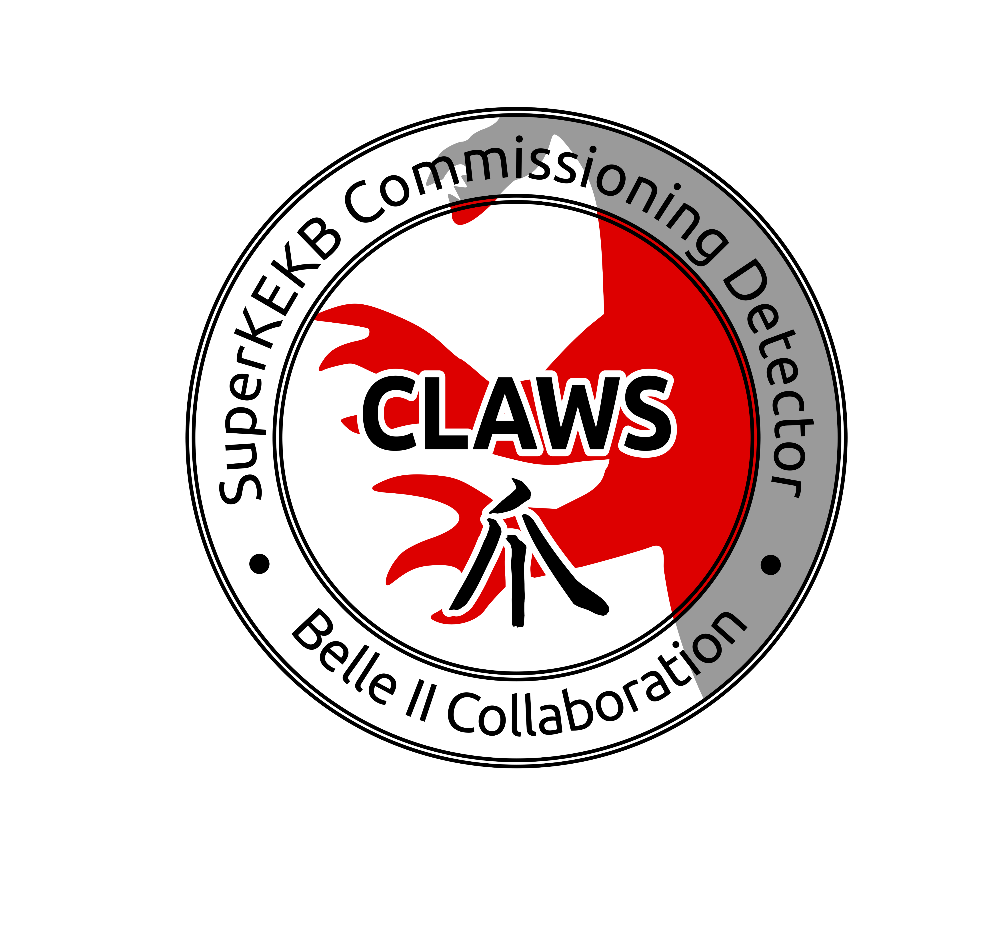

# CAT
This is the Claws-Analysis-Toolkit

Beast | Claws
------------ | -------------
 | 

Claws is a beam background monitor at the SuperKEKB Collider. CAT is develpoed to analyse online reconstructed data in a fast fashion.
